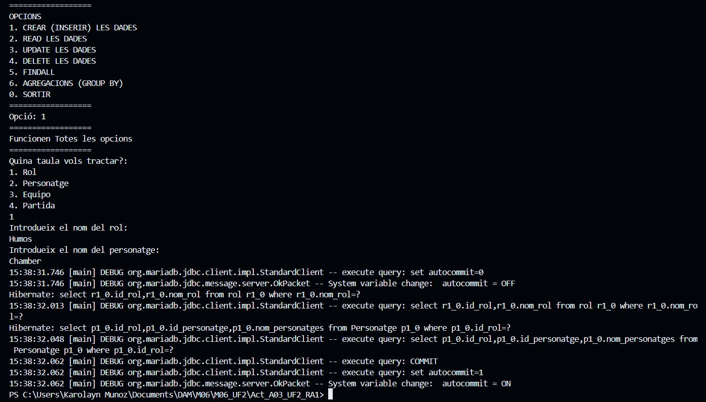
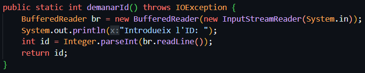
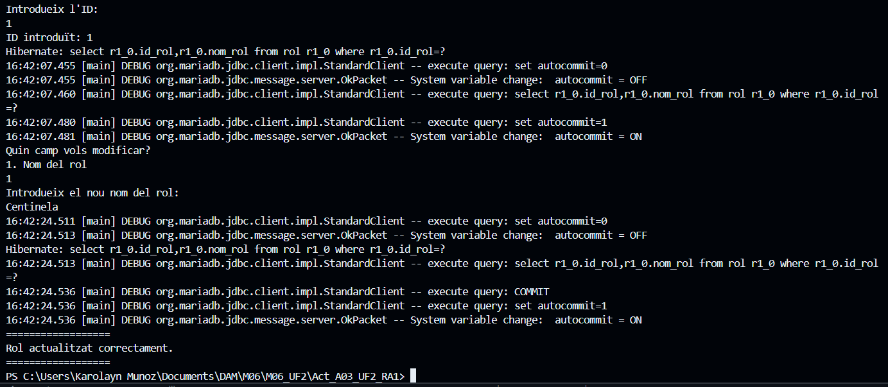

## M06-UF2

Aquesta activitat gestiona una base de dades per poder mantenir una bbdd de un joc, en aquest cas, VALORANT.

Gestiona dades relacionades amb rols, personatges, equips i partides en una base de dades mitjançant Hibernate. A través d'una interfície de consola, l'usuari pot realitzar operacions CRUD (Crear, Llegir, Actualitzar i Eliminar) sobre les taules de la base de dades. A més, ofereix funcionalitats per llistar tots els registres i fer consultes agregades mitjançant "GROUP BY".

El programa utilitza Hibernate per a la gestió de sessions i transaccions amb la base de dades, garantint una manipulació eficient i segura de les dades.

## Requeriments

* Totes les entitats amb els seus corresponents DAOs.
* El main de l'aplicació hauria de fer de forma mínima:
- Un menú on es faci triar a l'usuari les 4 accions més les dues requerides per la part 3 amb l'HQL a una sola (i sols una) de les entitats.
- Una setena i vuitena opció on una de les entitats persisteix l'altra i a l'inrevès. Cal que siguin entitats diferents de l'entitat emprada a les 6 primeres opcions.

## Descripció dels mètodes
### Comprovacions dins de cadascun

#### main(String[] args)

- Punt d'entrada del programa. Inicia la sessió de Hibernate, presenta un menú d'opcions i executa l'operació seleccionada per l'usuari.
Codi:

- Gestiona possibles excepcions relacionades amb Hibernate i altres possibles errors inesperats.
Codi:

##### MenuOptions(BufferedReader br):

- Mostra el menú principal amb opcions per inserir, llegir, actualitzar, eliminar, llistar i agregar dades.

- Retorna l'opció triada per l'usuari i es fa mitjançant un switch.

#####  demanarTaula(BufferedReader br)

Demana a l'usuari la taula sobre la qual vol operar (Rol, Personatge, Equip o Partida).
Aquesta opcio es fa en totes les opcions CRUD, findAll i GROUP BY.

#### dadesRol(BufferedReader br, SessionFactory sessio)

Demana dades per crear un nou rol juntament amb els seus personatges associats.

Crea una instància de "Rol" i "Personatge" i els emmagatzema a la base de dades.
Primerament es comprova si existeix algun rol amb el mateix nombre, llavors si existeix els assigna als personatges. Però si no, es persisteixen els rols i els personatges.

Basicament es demanen les dades al main per el mètode dadesRol, s'afegeix la informació a un objecte i s'envia a la clase RolDAO on es troba el mètode per persistir rol i personatge, fent primerament una comprovació de la seva existència.

Comprovació a la Terminal:
Es va escollir la primera opció per crear un rol. Després s'escull la taula per poder crear el rol. El seguent és introduir el nom del rol i el nom del personatge, pas seguent és esperar a que s'afegeixen les dades a la base de dades.

Aquest procediment es realitza a la resta de les clases, com son Personatge, Equip i Partida. Com es part del mètode Create de CRUD es fa a totes les entitats. Els mètodes són:

- dadesPersonatge(): Permet la creació d'un nou personatge i la seva associació amb un rol i un equip. Persisteix les dades a la base de dades.
- dadesEquip(): Demana informació per crear un nou equip i assignar-li un personatge. Desa l'equip a la base de dades.
- dadesPartida(): Demana l'ID d'un equip i l'assigna a una nova partida. Registra la partida a la base de dades.

#### demanarId()

Demana a l'usuari un ID per fer operacions de consulta o modificació.

#### readRol(BufferedReader br, SessionFactory sessio)

Demana un ID i recupera les dades d'un rol des de la base de dades.

Una vegada que es va obtenir l'Id s'envia cap a la classe RolDAO on es troba el mètode per trobar un rol mitjançant find() i el mostra.

Comprovació a la Terminal:
S'escull la primera opció per llegir el rol, després la taula Rol, i per últim, s'insereix el ID del rol que volem llegir. En aquest cas 1, llavors entre linies es mostra els resultats obtinguts d'aquest ID.

Aquest procediment es realitza a la resta de les clases, com son Personatge, Equip i Partida. Com es part del mètode Read de CRUD es fa a totes les entitats. Els mètodes són:
- readPersonatge(): Demana un ID i recupera la informació d'un personatge de la base de dades.
- readEquip(): Recupera les dades d'un equip utilitzant un ID proporcionat per l'usuari.
- readPartida(): Recupera les dades d'una partida segons l'ID introduït.

#### updateRol(BufferedReader br, SessionFactory sessio)

Permet actualitzar el nom d'un rol existent a la base de dades. Es demana l'Id per saber si existeix l'id a la base de dades, si el troba pregunta quin valor vol modificar, llavors envia les dades a RolDAO. 

 

Dins de la classe RolDAO.java es troba el mètode updateRol: amb aquest rebre l'id i no es null modifica els valors asignats.

Comprovació a la Terminal:
S'escriu l'Id que es vol modificar, després demana quin valor de rol es vol modificar i demana el nou valor. Si el canvi s'ha completat correctament surt un missatge d'actualització correcta al final.

Aquest procediment es realitza a dues clases, Rol i personatge. Com es part del mètode Update de CRUD es fa a Rol i personatge. Els mètodes són:
- updatePersonatge(): Permet modificar el nom o l'ID de rol d'un personatge.

#### deleteRol(BufferedReader br, SessionFactory sessio)

Elimina un rol de la base de dades segons l'ID introduït.
Demana l'Id de rol que es vol eliminar, llavor l'envia a RolDAO on es troba el mètode per poder fer aquesta eliminació mitjançant delete().

Comprovació en la Terminal:
Es demana l'Id del rol, es troba i s'elimina completament de la taula.

#### findAllRol(BufferedReader br, SessionFactory sessio)

Llista tots els rols emmagatzemats a la base de dades.

#### agregacionsRol(BufferedReader br, SessionFactory sessio)

Permet fer operacions d'agregació (GROUP BY) a la taula de rols, agrupant per ID o nom.

#### agregacionsPersonatge(BufferedReader br, SessionFactory sessio)

Realitza operacions d'agregació a la taula de personatges, agrupant per ID, ID de rol o nom del personatge.